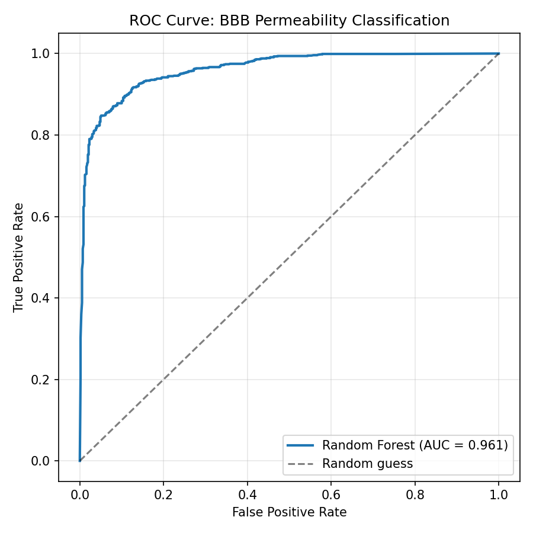
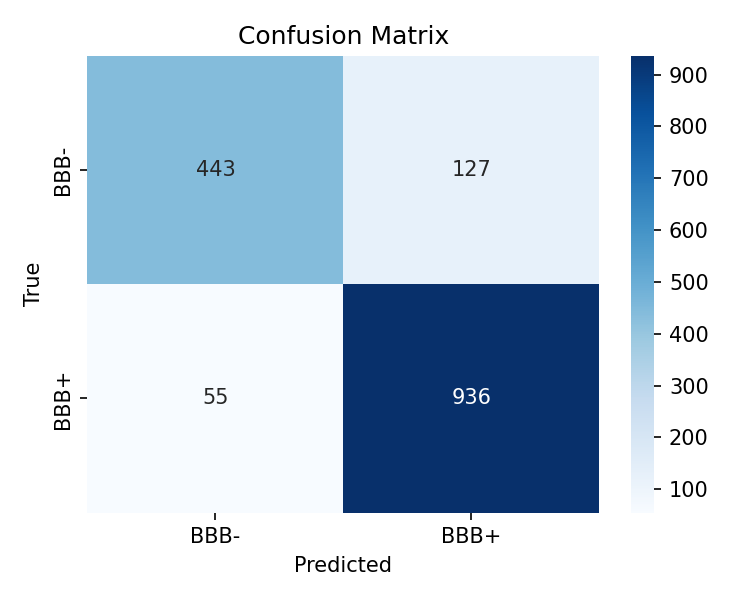
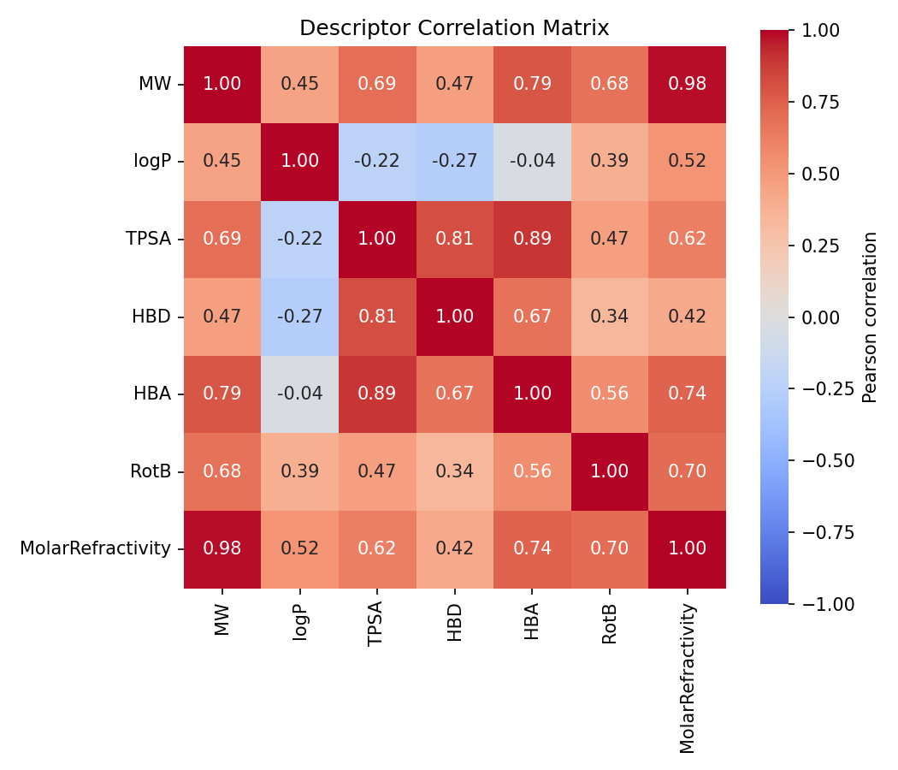
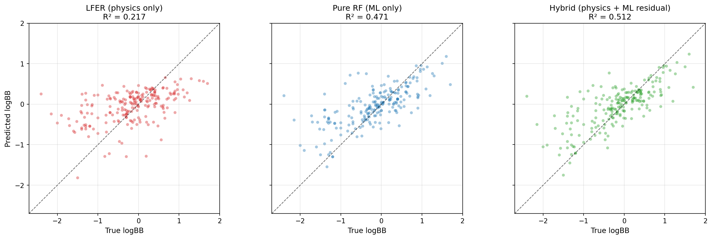
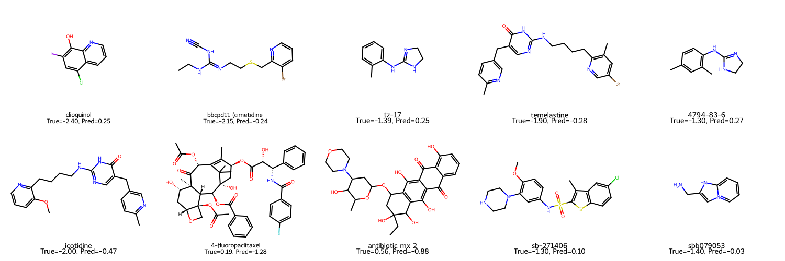

# Membrane Permeability Prediction — From Statistical Baselines Toward Physics-Informed Modeling

A comparative study of molecular permeability prediction across the blood-brain barrier, exploring the interface between statistical machine learning and physics-based modeling of membrane transport.

## Scientific Context

Membrane permeability is governed by well-understood physical processes — lipid-water partitioning, molecular diffusion, hydrogen-bond desolvation, cavity formation — that admit both mechanistic description (Abraham LFER, solution-diffusion theory, Stokes-Einstein) and data-driven prediction (molecular fingerprints, graph neural networks).

Most modern cheminformatics pipelines treat permeability as a purely statistical prediction problem. However, the field's foundational work (Clark, Abraham, van de Waterbeemd) demonstrated that a small set of physicochemical descriptors — logP, TPSA, hydrogen-bonding capacity — captures much of permeability variance through linear free energy relationships (LFER).

This project revisits that tension. On a standardized BBB dataset, it compares:

1. A statistical baseline (Morgan fingerprints + Random Forest)
2. A physics-based linear model (LFER-style on Abraham-like descriptors)
3. A hybrid model combining physics priors with ML residual correction

The goal is not a state-of-the-art score, but a transparent comparison of what each paradigm captures — and where physics fails in ways that ML can complement.

## Dataset

**B3DB** (Blood-Brain Barrier Database) — 7,807 curated molecules with binary BBB+/BBB- labels and 1,058 with continuous logBB values.
Source: [theochem/B3DB](https://github.com/theochem/B3DB).

- After RDKit sanitization: **7,805 molecules** for classification
- Continuous logBB subset: **1,058 molecules** for regression
- Class distribution: BBB+ (4,956) / BBB- (2,849), mild imbalance (~1.74:1)

## Part I — Statistical Baseline (Classification)

A Random Forest trained on 2048-bit Morgan fingerprints (radius=2) with balanced class weights, evaluated via 80/20 stratified split.

| Metric     | Value  |
|------------|--------|
| Accuracy   | 0.8834 |
| ROC-AUC    | 0.9612 |

<p align="center">
  
</p>

<p align="center">
  
</p>

### Per-class performance

|        | Precision | Recall | F1    |
|--------|-----------|--------|-------|
| BBB-   | 0.89      | 0.78   | 0.83  |
| BBB+   | 0.88      | 0.94   | 0.91  |

The model exhibits asymmetric recall — higher sensitivity for BBB+ (0.94) than BBB- (0.78). Most confident misclassifications cluster into two archetypes: large natural products (macrolides, terpenoids) and antibiotic-class compounds with MW > 500 Da, which exceed the effective applicability domain of radius-2 fingerprints.

## Part II — Physics-Informed Extension (Regression)

### LFER baseline

A linear regression on seven physicochemical descriptors — MW, logP, TPSA, HBD, HBA, rotatable bonds, molar refractivity — each carrying a mechanistic interpretation grounded in membrane transport theory.

**Test performance:** R² = 0.217, RMSE = 0.666

The modest R² is informative rather than disappointing. Inspection of the standardized coefficients reveals several sign violations relative to established physics (e.g., logP negative, MW positive) — a diagnostic signature of severe multicollinearity among the descriptors.

### Multicollinearity diagnosis

<p align="center">
  
</p>

The correlation matrix reveals that the seven descriptors span roughly **three effective dimensions**:

- A "size" axis: MW ↔ MolarRefractivity (r = 0.98)
- A "polarity/H-bonding" axis: TPSA ↔ HBA (r = 0.89), TPSA ↔ HBD (r = 0.81)
- A quasi-independent "hydrophobicity" axis: logP (only moderately correlated with the rest)

Ridge regression (L2-regularized) was applied as a standard remedy but yielded nearly identical performance (R² = 0.218), confirming that regularization alone cannot resolve near-perfect collinearity (r = 0.98). The plateau at R² ≈ 0.22 also likely reflects a **noise ceiling** imposed by the heterogeneous experimental provenance of B3DB logBB values (diverse animal models, assay protocols, and transport conditions).

### Hybrid model — physics + ML residual

The hybrid architecture uses LFER predictions as a physics-informed prior, then trains a Random Forest on Morgan fingerprints to predict only the **residuals** left by the physics baseline. Final prediction = LFER + RF_residual.

| Model | R² | RMSE | Interpretability |
|---|---|---|---|
| LFER (physics only) | 0.217 | 0.666 | High |
| Pure RF (ML only) | 0.471 | 0.548 | Low |
| **Hybrid (physics + ML residual)** | **0.512** | **0.526** | Medium (physics part) |

<p align="center">
  
</p>

**Key observation.** The hybrid model outperforms both individual baselines — including Pure RF, despite the latter having access to full molecular structure via 2048-bit fingerprints. The +4 percentage-point gain of Hybrid over Pure RF suggests that explicit physicochemical priors encode information that fingerprint-based ML cannot recover on its own. This is consistent with the view that physics-informed architectures are not merely "equivalent" to large ML models, but provide **complementary inductive bias**.

## Part III — Failure Mode Analysis

A qualitative examination of the ten worst LFER predictions reveals three distinct mechanistic categories where the linear additive framework breaks down:

<p align="center">
  
</p>

**1. Ionizable / permanently charged molecules** — e.g., amidine-containing tz-17, imidazolium sbb079053. LFER's seven descriptors contain no explicit charge or ionization term; permanent cations are systematically mispredicted.

**2. Active transport substrates** — e.g., cimetidine analog (P-gp efflux substrate), 4-fluoropaclitaxel (taxane scaffold). Molecules subject to carrier-mediated uptake or efflux violate the passive-diffusion assumption underlying LFER.

**3. Extreme molecular weight outliers** — e.g., 4-fluoropaclitaxel (MW 872) and macrolide-type antibiotics (MW > 500). These violate Lipinski's rule of five yet still permeate, suggesting additive descriptor models break down at scaffold extremes.

The ML residual correction in the Hybrid model partially recovers these cases by capturing scaffold-level fingerprint patterns that LFER cannot express — empirically validating the thesis that physics and ML provide complementary, non-redundant inductive biases.

## Project Structure
```
membrane-permeability-ml/
├── README.md
├── data/
│   └── B3DB_classification.tsv
├── notebooks/
│   ├── 01_explore_data.ipynb
│   ├── 02_baseline_model.ipynb
│   └── 03_physics_informed_model.ipynb
├── results/
│   ├── roc_curve.png
│   ├── confusion_matrix.png
│   ├── descriptor_correlation.png
│   ├── three_model_comparison.png
│   ├── lfer_worst_predictions.png
│   └── rf_baseline_model.pkl
└── src/
```

## Reproducibility

```bash
conda create -n memperm python=3.11 -y
conda activate memperm
pip install rdkit pandas scikit-learn xgboost matplotlib seaborn jupyter joblib
```

Download `B3DB_classification.tsv` from [theochem/B3DB](https://github.com/theochem/B3DB/blob/main/B3DB/B3DB_classification.tsv) into `data/`.

Run notebooks in order:
- `notebooks/01_explore_data.ipynb` — data exploration and quality control
- `notebooks/02_baseline_model.ipynb` — fingerprint featurization, training, evaluation
- `notebooks/03_physics_informed_model.ipynb` — LFER, multicollinearity diagnosis, hybrid model, failure mode analysis

## Limitations and Future Directions

- **Featurization ceiling.** Morgan fingerprints ignore 3D conformation, stereochemistry, and long-range electronic effects. Graph neural networks (e.g., Chemprop, D-MPNN) may close part of this gap.
- **Missing physical descriptors.** The failure mode analysis points to specific unmodeled physics — formal charge, ionization state, transporter recognition signatures. Incorporating explicit charge descriptors or pKa-derived features is a natural next step.
- **Noise ceiling.** The plateau at R² ≈ 0.22 for linear models likely reflects experimental heterogeneity in B3DB rather than modeling inadequacy. Filtering for protocol-consistent subsets, or re-measuring on a controlled platform (e.g., parallel artificial membrane permeability assay, droplet interface bilayers), would enable cleaner physics-informed benchmarking.
- **Passive-diffusion assumption.** All models here treat permeability as a property of the molecule alone. True permeability depends jointly on molecular structure, lipid composition, and membrane state — a trio that paired molecular-membrane datasets would be needed to address.

---

*Author*: Ying (Felix) Xu  
*Context*: Exploration at the intersection of membrane biophysics, physical chemistry, and machine learning — toward structured, physics-informed datasets for molecular-membrane interaction modeling.